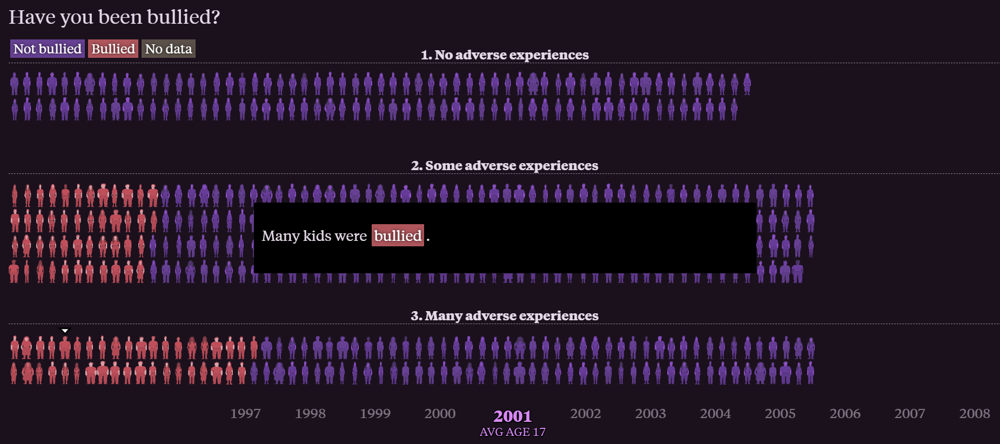
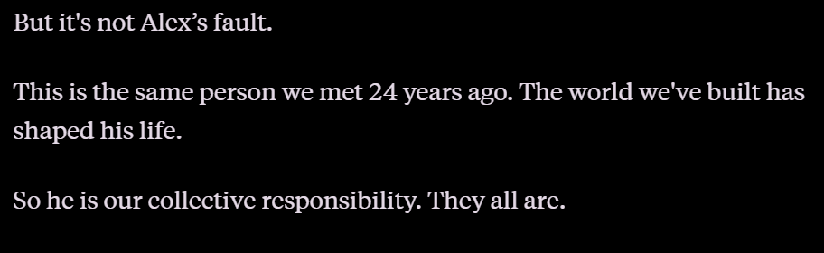
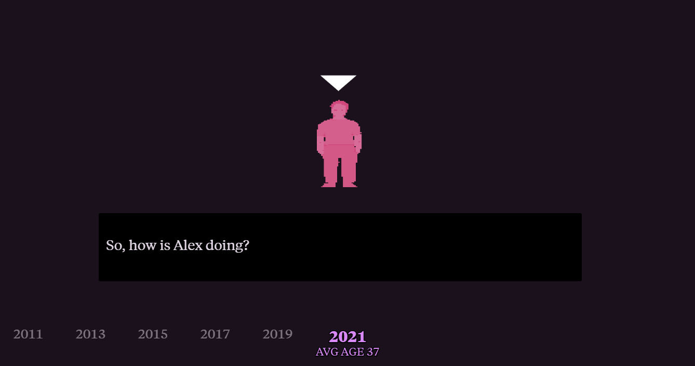

# Tarea 1

## Análisis de una Webstory 

### Datos generales

* Nombre: *What does it mean to be a teenager?*
* Fecha de publicación: Abril, 2024
* Sitio web: The Pudding
* URL: https://pudding.cool/2024/03/teenagers/ 

### **Descripción de la historia**

Esta webstory cuenta el viaje de una generación específica de estadounidenses que en 1997 eran adolescentes (con una edad promedio de 13 años) y a quienes se les siguió la pista durante 24 años, hasta el 2021, cuando ya tenían unos 37 años. La historia utiliza los datos de la Encuesta Nacional Longitudinal de la Juventud 1997 para mostrarnos cómo el punto de partida de un niño define casi por completo su destino como adulto.

La narrativa nos lleva por tres etapas clave. Primero, nos muestra la realidad de estos chicos en 1997: sus ingresos familiares, si vivían con ambos padres biológicos y el entorno de sus hogares. Luego, nos traslada al 2021 para ver los resultados de esas mismas personas en su adultez: cuánto dinero ganan, su nivel de estudios y su estado de salud. El relato principal no es solo estadístico, sino humano; trata sobre cómo la sociedad tiene mucha compasión por los niños que sufren hogares disfuncionales o pobreza, pero cómo esa misma sociedad cambia totalmente de actitud cuando esos niños crecen. Al llegar a los 18 años, se espera que "se arreglen solos" y, si fracasan o son pobres a los 37 años, se les culpa individualmente sin reconocer que cargan con las consecuencias de un contexto que ellos no eligieron.

*"Then we turn 18 and we're expected to be "adults" and figure things out.
If we fail, we are punished."*

 ### **Estructura narrativa y aspectos a destacar**

Lo que me parece más interesante es que logra convertir una base de datos gigante y abrumadora en un relato que se siente personal. No se lee una tabla de excel, sino que se sigue la evolución de miles de personas - con Alex como ejemplo designado- a lo largo de la mitad de su vida en tan solo unos minutos.

### Aspectos a destacar
* **El uso de animaciones como representación humana:**: Cada punto que se mueve en el gráficos es una de las personas encuestadas. Ver cómo esos miles de animaciones se separan y se agrupan según sus ingresos, su salud o raza es muy potente visualmente. Te permite entender la "desigualdad" de una forma física: ves cómo los grupos que empezaron con ventajas se mantienen arriba y los que empezaron con carencias se mantienen o descienden incluso más.
* **El progreso mediante el scroll**: La historia está diseñada para que uno marque el ritmo. A medida que bajas, los datos de 1997 se transforman en los resultados de 2021. Esta transición fluida ayuda a entender la relación de causa y efecto entre la infancia y la adultez sin necesidad de muchas explicaciones técnicas.
* **El cierre reflexivo**: Este es el punto más fuerte de la narrativa. La webstory no termina simplemente con un gráfico de resultados, sino que lanza una reflexión profunda sobre la pérdida de la compasión. Nos recuerda que el mundo es muy empático con el niño que sufre acoso o vive en un hogar disfuncional, pero que esa empatía se corta de golpe al cumplir los 18 años. La estructura narrativa utiliza los 24 años de datos acumulados para cuestionar por qué, como adultos, empezamos a "castigar" y culpar a las personas por no tener dinero o salud, olvidando que son los mismos niños vulnerables que vimos al principio del scroll. Este cierre le da un sentido ético a los datos: nos obliga a mirar al adulto de 37 años en 2021 no como un "fracaso individual", sino como el resultado lógico de una historia que empezó en 1997.

### **Evaluación de efectividad**

La webstory es extremadamente efectiva porque logra que la información sea visualmente atractiva sin perder el rigor.

1. **Claridad de la información**:
Lo que más se destaca es el fácil entendimiento que tienen los gráficos a pesar de manejar una gran cantidad de datos. Se aprecia el usa de etiquetas sencillas para saber qué grupo de personas estás viendo en cada momento. Por ejemplo, dividiendo a los que crecieron con muchas o pocas experiencias adversas, y que además dentro de esos grupos se puedan hacer otras divisiones, permitiendo ver datos como los ingresos actuales de quienes crecieron con muchas experiencias adversas. Por otro lado, el texto, cuando se presenta, es breve y conciso, no roba protegonismo a las imágenes y crea un equilibrio que nos permite una lectura ligera pero profunda al mismo tiempo.

2. **Calidad de la fuente**:
Al usar la encuesta NLSY97, la información tiene un respaldo institucional muy fuerte. No son suposiciones, son datos reales de seguimiento de 24 años. Esto hace que el mensaje final sobre la falta de movilidad social sea mucho más impactante.

3. **Áreas de mejora**:
Como punto a mejorar, creo que la navegación es demasiado rígida. Al ser una historia tan larga que depende totalmente del scroll, si quieres comparar un dato de la adultez con uno de la infancia, es muy difícil volver atrás sin perder el hilo. Además, aunque los gráficos son impactantes, en dispositivos móviles pueden ser un poco difíciles de manipular debido a la gran cantidad de elementos en movimiento. También se echa de menos alguna comparativa con datos de otros países para saber si este patrón de falta de movilidad social es igual en todo el mundo o algo específico de la cultura estadounidense. Ádemas, mejoraría la experiencia si es que además de los gráficos pudieramos ver el equivalente en números o porcentajes, ya que hay momentos donde dentro de las tres grandes categorías se hacen varios sub-grupos que hacen que cueste un poco más el entendimiento a momentos.

### **En conclusión:**
*What does it mean to be a teenager?* es un ejemplo excelente de cómo usar los datos para contar una historia con sentido humano. No se queda solo en porcentajes fríos, sino que usa la tecnología para visibilizar cómo la desigualdad se arrastra por décadas. Logra que el lector empatice con el "adulto fracasado" al recordarle que alguna vez fue un niño sin control sobre su entorno. Es una pieza de narrativa audiovisual que demuestra que el periodismo de datos puede no solo informar, sino que también nos invita a ser más comprensivos con las realidades ajenas.